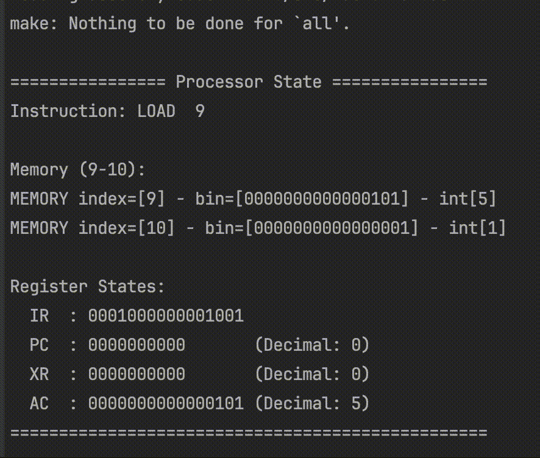

Processor emulator based on **Introduction to Machine and Assembly Language Programming by PHILIP J. GUST**


```bash
- cd rust-assembler
- cargo run ./src/factorial.asm  ../emulator.obj && cd .. && make && ./emulator && cd rust-assembler
```
### Demo logging of processor state, executing factorial and storing the result into memory

